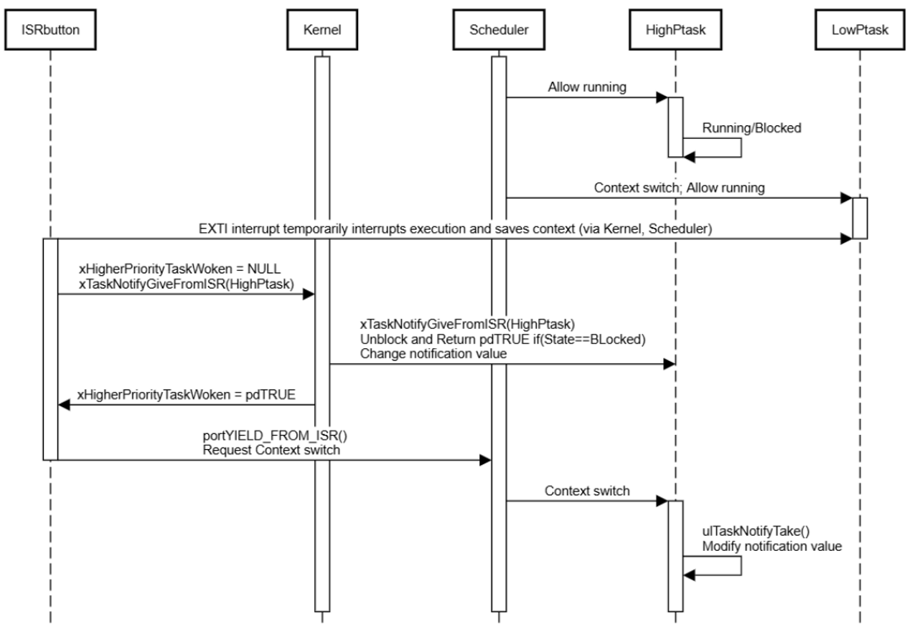

## Vẽ Sequence Diagram trên sequencediagram.org
* Bước 1: Mở trang web https://sequencediagram.org/
* Bước 2: Sử dụng mã để vẽ biểu đồ tương ứng
  * Khối mã gồm 3 thành phần:
    * Khai báo thành phần `participant`
    * Lệnh `activate`  và `deactivate`
    * Lệnh kết nối `A->B`
    * Xuống dòng giữa comment `text \n text`

```participant ISRbutton
participant Kernel
participant Scheduler
participant HighPtask
participant LowPtask

activate Kernel
activate Scheduler

Scheduler->HighPtask: Allow running
activate HighPtask
HighPtask->HighPtask: Running/Blocked
deactivate HighPtask

Scheduler->LowPtask: Allow running
activate LowPtask

ISRbutton->ISRbutton: EXTI interrupt
activate ISRbutton
ISRbutton->Kernel: xHigherPriorityTaskWoken = NULL\nxTaskNotifyGiveFromISR(HighPtask)

Kernel->HighPtask: xTaskNotifyGiveFromISR(HighPtask)\nUnblock and Return pdTRUE if(State==BLocked)
Kernel->ISRbutton: xHigherPriorityTaskWoken = pdTRUE
ISRbutton->Scheduler: portYIELD_FROM_ISR()\nRequest Context switch
deactivate ISRbutton

Scheduler->LowPtask: Context switch
deactivate LowPtask
Scheduler->HighPtask: Context switch
activate HighPtask
HighPtask->HighPtask: ulTaskNotifyTake()\nModify notification value
```

